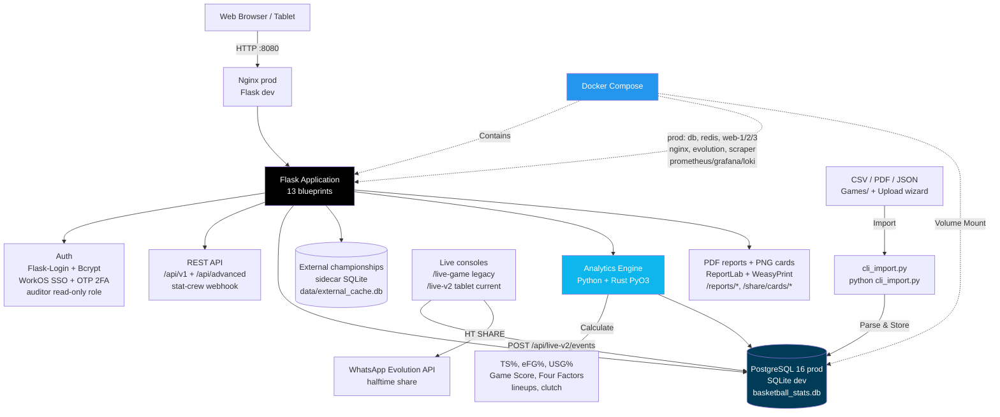

[](https://giuliomastromartino.github.io/Basketball-stats/)

# 🏀 Basketball Stats Analyzer

A web application for tracking and analyzing basketball game statistics with advanced metrics.

## System Architecture



## What It Does

- **Live Game Tracking**: tablet-first console (`/live-v2`, legacy `/live-game`) with shot charting, subs, play tagging, +/- and one-tap halftime WhatsApp share
- **Import Game Data**: CSV files in `Games/` (`python cli_import.py`), or PDF/JSON via the **Upload Game** wizard
- **Track Performance**: player stats (points, rebounds, assists, shooting splits, +/-)
- **Advanced Analytics**: TS%, eFG%, USG%, PPS, Game Score, Four Factors, shot quality, clutch, lineup on/off + duo/trio + 5-man rankings
- **Digital Playbook**: Offense/Defense/Special types seeded; plays are user-created with a Fabric.js canvas builder, PPP effectiveness tracking
- **Reports & Sharing**: server-side PDFs (game, player, lineup, season, clutch, halftime) + ZIP bundles, expiring share links (`/s/<token>`), 1080×1080 social cards, post-game comms templates, Veo/Pixellot timestamp export
- **Coaching**: season planner, training planner + PDFs, drill suggester, play suggester, NL queries, development goals (`/coaching`)
- **Web Interface**: dashboard, games, players, analytics at http://localhost:8080

## How It Works

1. **Data Import**: place CSV files in the `Games/` folder (`python cli_import.py`), or use **Upload Game** for CSV/PDF/JSON (PDF parsed automatically)
2. **Live Tracking (optional)**: track games courtside on `/live-v2` (current tablet console; `/live-game` is legacy) — shots, subs, fouls, play tags sync per-event
3. **Automatic Processing**: filenames parsed for game info (opponent, score, date); shot/play/lineup events stored alongside box scores
4. **Database Storage**: SQLite for local dev (`basketball_stats.db`), PostgreSQL 16 in prod; external championships live in a separate sidecar (`data/external_cache.db`)
5. **Analytics Engine**: Python + Rust (PyO3) metrics calculated automatically
6. **Web Display**: dashboard, game detail, players, analytics, PDFs at http://localhost:8080

## Quick Start (Local)

```bash
# 1. Clone and enter directory
git clone https://github.com/GiulioMastromartino/Basketball-stats.git
cd Basketball-stats

# 2. Create virtual environment
python -m venv venv
source venv/bin/activate  # Windows: venv\Scripts\activate

# 3. Install dependencies
pip install -r requirements-local.txt

# 4. Run the application
python quick_start.py

# 5. Open browser to http://localhost:8080
# Login: admin / admin123 (quick_start.py default; ADMIN_PASSWORD env overrides)
# Note: run_local.py sets DISABLE_AUTH=1 so no login is required there.
```

## Docker Deployment (TrueNAS Scale / General)

This project includes Docker support for easy deployment on TrueNAS Scale or any Docker environment.

### 1. Build the Image

Since you cannot pull this directly from Docker Hub yet, you need to build the image and push it to your own registry (Docker Hub, GHCR, etc.).

```bash
# 1. Login to your registry
docker login

# 2. Build the image
docker build -t your_username/basketball-stats:latest .

# 3. Push to registry
docker push your_username/basketball-stats:latest
```

### 2. Run with Docker Compose

Dev stack (`docker-compose.yml`: `db`, `web`, `scraper`, `cloudflared` — PostgreSQL + app via `entrypoint.sh` + championship sync + optional tunnel):

```bash
docker-compose up -d
```
Access the app at `http://localhost:8080`.

Production stack (`docker-compose.prod.yml`, deployed via Jenkins `scripts/deploy.sh` reading `.env.prod`): `db`, `redis`, `evolution` (WhatsApp), `migrator`, `scraper`, `web-1/2/3` (Gunicorn replicas), `nginx` (:8080), `prometheus`/`grafana`/`loki`/`promtail`.

### 3. Deploy on TrueNAS Scale (Custom App, single container with SQLite)

1.  **Log in to TrueNAS Scale**.
2.  Go to **Apps** -> **Discover Apps** -> **Custom App**.
3.  **Application Name**: `basketball-stats`
4.  **Image Configuration**:
    *   **Repository**: `your_username/basketball-stats`
    *   **Tag**: `latest`
    *   **Pull Policy**: `Always`
5.  **Environment Variables**:
    *   **DATABASE_URL**: `sqlite:////app/data/basketball_stats.db`
    *   **SECRET_KEY**: *(Generate a random string)*
6.  **Storage (Volumes)**:
    Map these Host Paths to your TrueNAS datasets to ensure data persists:
    *   **Host Path**: `/mnt/pool/path/to/data` -> **Mount Path**: `/app/data`
    *   **Host Path**: `/mnt/pool/path/to/Games` -> **Mount Path**: `/app/Games`
    *   **Host Path**: `/mnt/pool/path/to/Output` -> **Mount Path**: `/app/Output`
7.  **Networking**:
    *   **Container Port**: `8080`
    *   **Node Port**: `9080` (or any available port)
8.  **Deploy**: Click Save/Install.

## CSV File Format

**Filename Pattern:**
```
Opponent_YourScore-TheirScore_DD-MM-YYYY_Type.csv

Examples:
Lakers_105-98_15-03-2024_S.csv     (Season game)
Warriors_88-92_20-03-2024_P.csv    (Playoff)
Celtics_95-90_25-03-2024_F.csv     (Friendly)
```

**Required Columns in CSV:**
```
Name, MIN, PTS, FGM, FGA, FG%, 3PM, 3PA, 3P%, 
FTM, FTA, FT%, OREB, DREB, REB, AST, TOV, STL, BLK, PF
```

**Import Your Data:**
```bash
# Place CSV files in Games/ folder, then run:
python cli_import.py
# Or use the web UI: Upload Game (CSV, PDF, or JSON)
```

## Key Features

- 📊 Advanced basketball analytics (TS%, eFG%, USG%, PPS, Game Score, Four Factors, shot quality, clutch)
- 🏆 Win/loss tracking with opponent records
- 👥 Player performance history and trends
- 🎥 Live tablet console (`/live-v2`, legacy `/live-game`) with halftime WhatsApp share
- 🔐 Secure login system (Flask-Login + Bcrypt, WorkOS SSO, OTP 2FA for managers, read-only auditor role; `DISABLE_AUTH=1` single-user mode via `run_local.py`)
- 📈 Career statistics and averages
- 🌐 Versioned JSON API (`/api/v1`) with stat-crew import webhook
- 🎯 **Advanced Analytics Dashboard**
  - Shot Charts with Court Mapping
  - Hexbin/Heatmaps for Hot Zones
  - True Usage Rate (USG%)
  - Points Per Shot (PPS)
  - Shot Quality Model with Expected Values
  - Clutch Performance Analysis
- 👥 **Lineup Analytics**
  - On/Off Court Splits
  - Duo/Trio Compatibility Matrix
  - 5-Man Lineup Efficiency Rankings
  - Rotation Analysis
- 📄 **Advanced PDF Reports** (+ 1080×1080 social cards, ZIP bundles, expiring share links `/s/<token>`)
  - Visual Game Report (Score Worm, Four Factors)
  - Player Scouting Cards
  - Season Trend Reports
  - Clutch Time Reports

## Tech Stack

- **Backend**: Flask 3.x (3.0 local / 3.1 prod), SQLAlchemy 2.0, PostgreSQL 16 (prod) / SQLite (dev)
- **Analytics**: Pandas, NumPy, SciPy, Rust (PyO3) zone/shot module (built with maturin)
- **Security**: Flask-Login, Bcrypt, WorkOS SSO, email/WhatsApp OTP 2FA for managers, read-only auditor role, Flask-WTF CSRF, Flask-Limiter (200/day, 50/hour)
- **API**: versioned JSON API (`/api/v1`) + stat-crew import webhook (`POST /api/v1/games/import`)
- **Ingest**: CSV/PDF import wizards, external championships sidecar (Playbasket/FIP adapters + daily cron, `data/external_cache.db`) with per-championship sync health (`/analytics/championship/sync-health`, `/health/sync`)
- **Coaching**: tablet live console (`/live-v2`), training planner with PDF storyboards, season planner, drill suggester, play-effectiveness PPP, lineup optimizer, scout reports, NL queries, play suggester, development goals
- **Sharing**: expiring public links (`/s/<token>`), 1080×1080 social PNG cards, post-game comms templates, halftime WhatsApp one-tap, video timestamp export (Veo/Pixellot)
- **Deploy/obs**: Docker + TrueNAS path, Jenkins pipeline, Prometheus/Grafana/Loki (`/metrics`, `/health/*`), native iOS app in `Native/`

## Requirements

- Python 3.11+ (local dev on 3.12; Docker image pins 3.11-slim) + system libs for WeasyPrint (`libpango`, see `Dockerfile`)
- ~1GB disk for venv + data volumes for DB/uploads/sidecar (not 16MB)
- Modern web browser
- Docker (for compose/prod deploys); Rust toolchain only if rebuilding the PyO3 module outside Docker (image builds the wheel with maturin)

## Project Structure

```
Basketball-stats/
├── Games/              # Place CSV files here
├── core/               # Analytics, parsers, PDF builders, services/ (11 services)
├── web/                # Flask app factory + 13 blueprints, templates (~61), static/
├── jobs/               # Cron: championship_sync, check_sync_health (+ adapters/)
├── scripts/            # init_db, migrate, seed_db, deploy.sh, promote_admin, …
├── basketball_stats_rust/ # Rust PyO3 module (maturin wheel)
├── tests/              # Pytest suite (59 files, ~861 tests)
├── docs/               # MkDocs site (mkdocs.yml); docs/archive/ is frozen history
├── Native/             # iPadOS SwiftUI foundation (XcodeGen, not shipped with web app)
├── grafana/ prometheus/ loki/ promtail/ nginx/ # prod observability + proxy
├── migrations/         # Alembic dir (versions/ empty by design) + legacy_migrations/ (frozen)
├── quick_start.py      # Setup and run script (--no-run, --reset, --port)
├── run.py              # WSGI/dev entry (also used by gunicorn_config.py)
├── run_local.py        # No-auth dev server (DISABLE_AUTH=1)
├── cli_import.py       # CSV import tool (python cli_import.py)
├── manage.py           # Flask CLI entry
└── requirements-local.txt / requirements.txt
```

## Troubleshooting

**Port already in use?**
```bash
python quick_start.py --port 8081
```

**Reset database?**
```bash
python quick_start.py --reset   # deletes basketball_stats.db and reseeds
# or: python reset_empty.py     # clean DB with admin only, no sample games
```

**Run app from new database**
```bash
python reset_empty.py
python cli_import.py
python quick_start.py
```

**Import not working?**
- Check filename matches pattern exactly
- Verify all required CSV columns are present
- Ensure no duplicate game files

## License

Apache License 2.0

## Repository

https://github.com/GiulioMastromartino/Basketball-stats

---

**⭐ Star the repo if you find it useful!**

## 🚀 Deployment on TrueNAS Scale (details)

See **Docker Deployment (TrueNAS Scale / General)** above for the single-container SQLite path. Notes specific to TrueNAS UI (Electric Eel or later):

- The dev `docker-compose.yml` uses PostgreSQL + bind mounts (`./Games:/app/Games`, `./Output:/app/Output`, `./uploads:/app/uploads`), **not** `./instance` — on TrueNAS replace those with ZFS host paths (e.g. `/mnt/tank/apps/basketball-stats/games`) so the DB and files persist.
- The Dockerfile creates `/app/Games /app/Output /app/uploads /app/instance`; the default SQLite file is `basketball_stats.db` in the app dir (`config.py`), so persist whichever path your `DATABASE_URL` points at. If you use the prod compose path, persist the `postgres_data` volume dataset instead.
- Manual CLI equivalent (SQLite single container):

```bash
docker run -d \
  -p 9080:8080 \
  -e SECRET_KEY="generate-a-random-string" \
  -e DATABASE_URL="sqlite:////app/data/basketball_stats.db" \
  -v /mnt/your-pool/app-data:/app/data \
  -v /mnt/your-pool/games:/app/Games \
  -v /mnt/your-pool/output:/app/Output \
  --name basketball-stats \
  your_username/basketball-stats:latest
```

Full production reference (PostgreSQL + replicas + observability): `docker-compose.prod.yml` + `docs/technical/deployment.md`.
